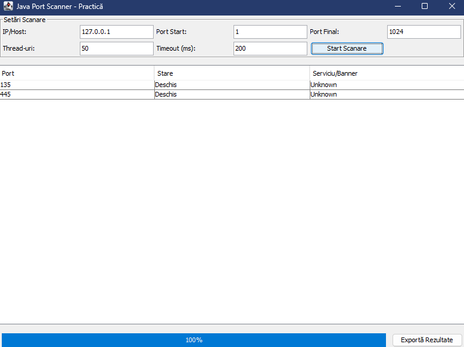

# 🛡️ Java Multithreaded Port Scanner

This project represents a complete desktop **Port Scanner** application developed in Java for the university internship stage. The application enables efficient scanning of TCP ports for a specific Host or IP address, providing real-time visual feedback and the capability to export audit results.

---

### 📸 Preview



---

## 🚀 Key Features

* **High Performance (Multithreading):** The scanning logic utilizes a thread pool (`ExecutorService`), allowing simultaneous verification of dozens of ports and massively reducing the total execution time.
* **Responsive Graphical Interface (GUI Swing):** The design is built entirely using Swing. To prevent the window from freezing during intensive scans, the network logic is decoupled from the main Event Dispatch Thread (EDT) using `SwingWorker` technology.
* **Clean Architecture (Separation of Concerns):** The project adheres to Object-Oriented Programming (OOP) principles, maintaining a clear separation between business logic (networking/sockets), the visual interface, and system utilities.
* **Export Functionality:** The application provides the ability to save the live scanning results into a local file (CSV/TXT format) for subsequent security auditing.

## 🛠️ Technologies and Concepts Used

* **Language:** Java 17
* **Project Management:** Modular structure based on the Maven standard (`pom.xml`)
* **Networking:** `java.net.Socket` (TCP/IP protocol connections with customizable Timeout)
* **Concurrency:** `java.util.concurrent.ExecutorService`, `ThreadPoolExecutor`
* **GUI:** Java Swing (`JFrame`, `JTable`, `JProgressBar`, `SwingWorker`)

## 📂 Project Structure

* `src/main/java/com/scanner/Main.java` - The entry point of the application.
* `src/main/java/com/scanner/core/` - Contains the scanning engine (`PortScanner`) and the data model for results (`ScanResult`).
* `src/main/java/com/scanner/gui/` - Contains the class responsible for the graphical user interface (`MainFrame`).
* `src/main/java/com/scanner/util/` - Contains the logic for disk writing and exporting report files (`ResultExporter`).

## ⚙️ How to Run the Project

### From Terminal
To compile and run the project without an IDE, navigate to the root directory and execute:
```bash
javac -d out src/main/java/com/scanner/Main.java src/main/java/com/scanner/core/*.java src/main/java/com/scanner/gui/*.java src/main/java/com/scanner/util/*.java
java -cp out com.scanner.Main
